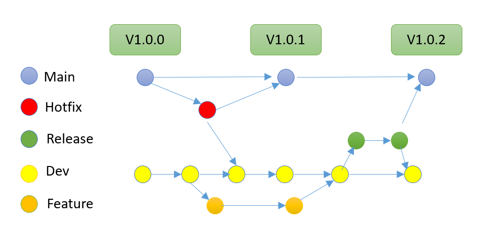

# Organización de Ramas Git



Nuestro flujo de trabajo de Git sigue una estructura de ramas bien definida, organizada en cinco tipos principales de ramas, cada una con un propósito específico:

1. **Master (Rama Principal):** Representada en color azul, es la rama principal que contiene el código en producción y refleja la versión estable de la aplicación. Las versiones etiquetadas como V1.0.0, V1.0.1, y V1.0.2 en la imagen son las versiones a presentar al final de los Sprints.

2. **Hotfix (Corrección Rápida):** En color rojo, esta rama se usa para implementar correcciones de errores críticos en producción. Estas correcciones se crean a partir de **`master`** y, una vez solucionados los errores, se fusionan de vuelta en **`master`** y **`develop`** para mantener consistencia.

3. **Release (Lanzamiento)**: Las ramas en verde se utilizan para preparar una nueva versión de producción. Aquí se realizan los últimos ajustes y pruebas antes de pasar el código a **`master`**. Una vez que se completa una versión en Release, esta se fusiona en **`master`** para el despliegue y en **`develop`** para mantener actualizada la rama de desarrollo.

4. **Develop (Desarrollo):** Representada en amarillo, es la rama base para el trabajo de desarrollo continuo. Aquí se integran y prueban los cambios de nuevas funcionalidades y correcciones antes de que estén listos para ser considerados en un lanzamiento.

5. **Feature (Funcionalidades):** Las ramas de funcionalidad, en color naranja, se crean a partir de **`develop`** y representan el desarrollo de nuevas características específicas. Una vez que una funcionalidad está completa, se fusiona en **`develop`** para pruebas y evaluación conjunta.


## Flujo de Trabajo

- **Desarrollo de Funcionalidades:** Las funcionalidades nuevas se desarrollan en ramas **`feature`**, y cuando están listas, se integran en **`develop`**.
- **Preparación de Lanzamientos:** Las ramas Release se crean a partir de **`develop`** cuando se aproxima una nueva versión. Tras realizar ajustes finales, la rama **`release`** se fusiona en **`master`** y **`develop`**.
- **Correcciones Rápidas:** Si surge un error crítico en producción, se crea una rama **Hotfix** desde **`master`** para resolverlo de inmediato. La corrección se integra luego en **`master`** y **`develop`**.


# Nuxt Minimal Starter

Look at the [Nuxt 3 documentation](https://nuxt.com/docs/getting-started/introduction) to learn more.

## Setup

Make sure to install the dependencies:

```bash
# npm
npm install

# pnpm
pnpm install

# yarn
yarn install

# bun
bun install
```

## Development Server

Start the development server on `http://localhost:3000`:

```bash
# npm
npm run dev

# pnpm
pnpm run dev

# yarn
yarn dev

# bun
bun run dev
```

## Production

Build the application for production:

```bash
# npm
npm run build

# pnpm
pnpm run build

# yarn
yarn build

# bun
bun run build
```

Locally preview production build:

```bash
# npm
npm run preview

# pnpm
pnpm run preview

# yarn
yarn preview

# bun
bun run preview
```

Check out the [deployment documentation](https://nuxt.com/docs/getting-started/deployment) for more information.
